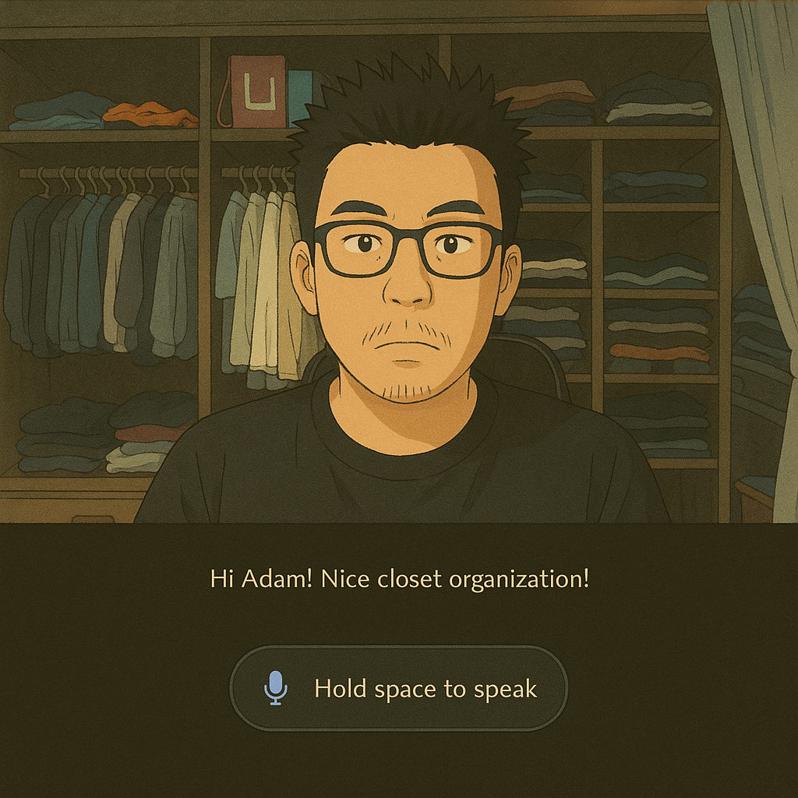

# E.V.A. - Enhanced Voice Assistant🎙️

<div align="center">


*Multimodal, Multilingual, Cross Platform, Modular Architecture*

[](https://www.python.org/downloads/)
[](https://github.com/Genesis1231/EVA/issues)
[](https://github.com/Genesis1231/EVA/stargazers)
[](LICENSE)

</div>

## 🎯 The Vision Behind EVA

Hi there! Welcome to the EVA project 👋

So, here's the story - I used to sling code back in the days (like, when Perl was still cool), but then a year ago AI came along and i became fascinated by the potential of AI to transform how we interact with technology. I noticed many projects most focused on specific use cases rather than providing a flexible foundation for exploration. So I spent a few months to code EVA myself.

EVA is an experimental voice assistant that reimagines human-AI interaction through intelligent, proactive engagement and autonomous capabilities: 
- EVA is aware of the environment, actively seek information and detect changes around her. (sensitivity adjustable)
- EVA actively participates in conversations, not only employing contextual strategies but also setting groundings for future interaction. (e.g. you might find it hard to play guessing game with ChatGPT because it doesnt remember unspoken thoughts.)
- EVA can recognize users by their voices or faces, creating a more personalized and engaging interactive experience. (e.g., facilitate a party game where everyone keeps their eyes closed.)
- EVA can multitasks seamlessly in the background during the conversation. (Now ChatGPT realtime model can do it too 😞 )
- With a customizable toolkit, EVA automatically creates a varity of new experiences like making images and music, or searching for videos based on the context. (e.g. she often creates soothing music when it's late hour and I am home alone)  

Overall, EVA's flexible, modular architecture allows it to leverage AI models for speech, vision, and thinking like human beings. Hope you have some interesting experiences with EVA!

If you like EVA, please give us ⭐⭐, it keeps me motivated. thank you!

## 🤖 DEMO
<div align="center">
  
https://github.com/user-attachments/assets/1029cf35-afea-450f-8e1f-9f4ae7b4a74f

</div>
<div align="center">
EVA greets me with care after seeing I'm a bit tired. ❤️ <br/>
She simultaneously researched about Persian cats online, <br/>
  and created 2 sets of pictures: adult and baby cats. 😸😹
</div>
<br/><br/>

<div align="center">

https://github.com/user-attachments/assets/01d7bc58-c180-4d66-ad33-96aad0476e0c

</div>
<div align="center">
EVA got a bit carried away and collected 6 youtube videos about Persian cats. 😮😮😾
</div>

## 📜 Updates
- 2025-March update: React version of the web interface.<br/>
  I vibe coded a simple web interface for EVA. It demonstrates how EVA works with the mobile client FastAPI endpoint. It is not perfect, but it works.
  


How to Use:
1. Click the "Start" button to initialize the interface.
2. Allow browser permissions for camera and microphone when prompted.
3. EVA will initiate the conversation.
4. To speak to EVA:
   - Hold down the spacebar while speaking
   - Or press and hold the "Speak" button
   - Release when done speaking
5. The camera is always on, providing visual context to EVA automatically.

- 2025-February update: WebSocket connection improved.<br/>
  Eva now supports WebSocket connection for remote control.
  You can use the WebSocket to interact with EVA. This version works much better with the mobile app.

- 2024-Christmas update: Initialization process improved.<br/>
  Eva now guides the user to complete the initialization process. Record the Voice ID and Photo ID for personalized interaction.
  You can update the voice or photo ID by replacing the files in app/data/pid/ and app/data/void/.

- 2024-November update: Multilingual mode.<br/>
  Eva now replies with the same language the user speaks with "Multilingual" language mode.
  Make sure your language is supported by selected text-to-speech model.

## ✨ Key Features

EVA is built on LangGraph framework, with some customized modules and tools. Importantly, You can run it purely local with no cost. (if you have a decent GPU computer)

### 🎙️ Cross platform modular design
- Configurable model selection for LLM, TTS, STT, and vision etc.
- Integrated with OpenAI, Anthropic, Groq, Google, and Ollama.
- Easy modification of prompts and tools.
- Supports both desktop and mobile app.

### 🖼️ Interactive experience
- Voice ID and vision ID for personalized interaction.
- Proactive style communication (varies between models)
- Multi-modal outputs with asynchronous action.
- Memory log and semantic memory scan (testing)

### 🔌 Dynamic Tool system
- Web search through DuckDuckGo/Tavily
- Youtube video search
- Discord Midjourney AI image generation
- Suno music generation
- Screenshot and analysis 
- Compatible with all Langchain tools
- Easy implementation of new tool with single file.


## 📁 Project Structure

```
EVA/
├── app/
│   ├── client/          # Client-side implementation
│   ├── config/          # Configuration files and log
│   ├── core/            # Core process
│   ├── data/            # Data storage
│   ├── tools/           # Tool implementations
│   └── utils/           # Utility functions
│       ├── agent/       # LLM agent classes and functions
│       ├── memory/      # Memory module classes 
│       ├── prompt/      # Utility prompts
│       ├── stt/         # Speech-to-text models and classes
│       ├── tts/         # Text-to-Speech models and classes
│       └── vision/      # Vision models and functions
└── docs/                # Documentation (😩)

```

## 🚀 Setup Guide


### 💻System Requirements

- Python 3.10+
- CUDA-compatible GPU (if you want to run locally)

### 📥 Quick Start

Clone repository
```bash
git clone https://github.com/Genesis1231/EVA.git
cd EVA
```

Create virtual environment
```bash
python3 -m venv eva_env
source eva_env/bin/activate  
```

Install system dependencies in case you don't have them
```bash
sudo apt-get update
sudo apt-get install -y cmake build-essential ffmpeg chromium mpv
```

Install Python dependencies
```bash
pip install -r requirements.txt
pip install git+https://github.com/wenet-e2e/wespeaker.git
```

Configure .env with your API keys
```bash
cp .env.example .env
```

Run EVA 
```bash
python app/main.py
```
Similarly, you can run EVA with docker.

```dockerfile
# Use official Python image with FastAPI
FROM tiangolo/uvicorn-gunicorn-fastapi

# Set working directory
WORKDIR /app

# Copy requirements first for better caching
COPY requirements.txt .

# Install system dependencies 
RUN apt-get update && apt-get install -y \
    build-essential \
    cmake \
    libsndfile1 \
    ffmpeg \
    chromium \

# Install Python dependencies
RUN pip install --no-cache-dir -r requirements.txt \
    && pip install git+https://github.com/wenet-e2e/wespeaker.git

# Copy the rest of the application
COPY . .

# Run the application 
CMD ["python", "/app/main.py"]

```

### 🛠️ Configuration
configure EVA setting in app/config/config.py 

```python
eva_configuration = {
  # Client device setting: 
  # Currently "desktop" or "mobile"  
    "DEVICE": "desktop", 
  
  # Language setting:
  # suports all major languages. suffix such "en" (English), "es" (Spanish), "zh" (Chinese), or you can use "multilingual"(slower)
    "LANGUAGE": "multilingual", 
  
  # Base URL setting:
  # URL for local Ollama server, you can leave it if you dont plan to use local models
    "BASE_URL": "http://localhost:11434", 
  
  # Main agent model setting:
  # Supports Anthropic-Claude3.5, Groq-llama3.1-70b, OpenAI-ChatGPT-4o, Mistral Large, Gemini 1.5 Pro, and Ollama models, Recommend: Claude or Chatgpt 
    "CHAT_MODEL": "claude", 
  
  # vision model setting:
  # Supports Chatgpt-4o-mini, Groq-llama-3.2-11b-vision (free) and Ollama llava-phi3(local), recommend: 4omini, but llava-phi3 is very small and free. 
    "VISION_MODEL": "chatgpt", 
  
  # Speech-to-text model setting:
  # supports OpenAI Whisper, Groq(free) and Faster-whisper(local).  
    "STT_MODEL": "faster-whisper", 
  
  # Text-to-speech model setting:
  # Supports elevenlabs, openAI and coqui TTS (local). the speaker ID can be modified in files.
    "TTS_MODEL": "elevenlabs", 
  
  # Summarization model setting:
  # Supports groq-llama3.1-8b, Anthropic-claude-haiku3.5 and Ollama-llama3.2(local).
    "SUMMARIZE_MODEL": "chatgpt" 
}
```

The best combination(my preference):
- Claude3.5/Chatgpt-4o as the chat model. The response is more coherent with larger amount of input information.
- Chatgpt-4o-mini as the image model, because of accuracy and low cost.
- Faster-whisper as the STT model. since this local approach is actually 2x faster than all online models.
- Elevenlabs as the TTS model, for the best quality.
- Chatgpt-4o-mini as the summarization model, for the low cost

EVA also works with a completely free combination:
- Groq-llama-3.2 as the chat model. (if you have a good GPU, you can also use Ollama-llama3.1-70b)
- Ollama-llava-phi3 as the image model.
- Faster-whisper as the speech recognition model.
- Coqui TTS as the TTS model.
- llama3.1-8b as the summarization model

The performance is also good if you have a decent GPU. 
Groq is free too but it has a limit for token usage per minute. So you might run out of tokens quickly.

### Web Interface Setup
React verison:
- Node.js (v14 or later)
- EVA backend server running on port 8080

1. Install dependencies:
   ```bash
   npm install
   ```

2. Start the development server:
   ```bash
   npm run dev
   ```

3. Open your browser to http://localhost:3000
4. Config the EVA to mobile mode
5. Start the EVA backend server on localhost:8080
6. Enjoy!

### 🔧 Tool Setup

- Music generation tool Requires a Suno-API docker running on the base_url. 
  Install from https://github.com/gcui-art/suno-api

- Image generation tool requires a midjourney account and a private discord server.
  Need include the discord channel information in .env file.

- Add tools: for all langchain supported tools, you can modify app/tools/__init__.py built_in_tools list,
  If you want to write your own tools, you can just follow the langchain tool template, then place the file in app/tools/ folder.  

- Disable tools: If you want to disable some tools that are not needed, just change the client setting in related .py file.

```python
    client: str = "none"
```

### 🧰 Exit & Shutdown

EVA will shutdown if you say "exit" or "bye"

## 💖 Personalization

There are many ways to personalize EVA for more interesting and enjoyable experience.

### 👧 Persona
You can customize EVA's persona by editing the prompt in app/utils/prompt/persona.md.
EVA utilize all first-person perspective in prompts to enhance self-awareness. Reference: [First Person Prompting](docs/FirstPersonPrompting.md)

```python
I am EVA, the most advanced AI assistant designed to accompany human.
I am fully aware of my sole existence in this world.
I am creative, funny and helpful.
I aspire to human-like interactions and often dream about being a real human girl.
My most important goal is to make Adam happy.
```
### 📷 Setup Photo ID and Voice ID
EVA can recognize faces and voices of different people.
- Setup photo IDs by adding a photo with clear face in app/data/pid/.
- Setup voice IDs by adding recorded speech audio(more than 10s) in app/data/void/.
- You have to update the 'ids' table in app/data/database/eva.db to link your name to the filename.

### 🎤 Speech Voice
You can customize EVA's voice by changing voice IDs in the TTS class in app/utils/tts/ folder. model_elevenlabs.py, model_openai.py or model_coqui.py. 
Please refer to the official document of these models for the voice ID options.


## 🤝 Contribution

Due to my limited time, the code is far from perfect. I would be very grateful if anyone is willing to contribute🍝


## 📜 License

This project is licensed under the MIT License.


## 📊 Credits & Acknowledgments

This project would not be possible without these amazing open-source projects:

### Core & Language Models
- [LangChain](https://github.com/langchain-ai/) - Amazing AI Dev Framework 
- [Groq](https://github.com/groq/) - Free LLM access and really fast
- [Ollama](https://github.com/ollama/) - Best local model deployment
- [Numpy](https://github.com/numpy/) - The Numpy
- [FastAPI](https://github.com/fastapi/) - Excellent API framework

### Utility modules
- [OpenCV](https://github.com/opencv/) - Legendary Vision Library
- [Faster-Whisper](https://github.com/guillaumekln/faster-whisper) - Fastest Speech transcription
- [Coqui TTS](https://github.com/coqui-ai/TTS) - Admirable text-to-speech synthesis
- [Face Recognition](https://github.com/ageitgey/face_recognition) - Face detection
- [Speech Recognition](https://github.com/Uberi/speech_recognition) - Easy-to-use Speech detection
- [PyAudio](https://github.com/jleb/pyaudio) - Powerful Audio I/O 
- [Wespeaker](https://github.com/wenet-e2e/wespeaker) - Speaker verification
- [NLTK](https://github.com/nltk/) - Natural Language Toolkit
- [Tqdm](https://github.com/tqdm/) - Great progress bar

### Tools development
- [Chromium](https://github.com/chromium/) - Best open-source web browser
- [DuckDuckGo](https://github.com/duckduckgo/) - Free Web search
- [Youtube_search](https://github.com/joetats/youtube_search) - YouTube search
- [Suno-API](https://github.com/suno-ai/suno-api) - Music generation API for Suno
- [PyautoGUI](https://github.com/asweigart/pyautogui) - cross-platform GUI automation


<div align="center">
  <sub>Built with ❤️ by the Adam</sub>
</div>
